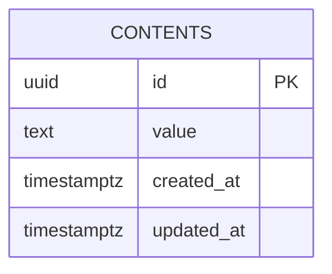

# Database Design (ERD) — Let's build a website

Engine: PostgreSQL 16
Last updated: 2026-05-27
Source requirements: `docs/content/SRS.md`

## 1. Overview

The schema stores exactly one thing: the single content row whose value the
screen renders. There is one aggregate root — the content row — and nothing
else. No accounts, no sessions, no audit tables: the SRS has one actor (Guest),
no write action, and a fixed value. Files, cache, and any third-party system are
all out of scope; the only persisted data is the text.

## 2. Diagram

One entity, no relationships. The product is a single screen showing a single
value, so there is nothing to relate.

Cardinality notation: `||` exactly one, `o|` zero or one, `}o` zero or many,
`}|` one or many. Read left to right. (None apply here.)

## 3. Entities

### 3.1 `contents`

**Purpose** — holds the one display string the site serves.
**Traces to** — CONTENT-001, CONTENT-002, CONTENT-003 (the value read and
rendered), and SRS §4 "Data touched" (`text`).

| Column | Type | Null | Default | Unique | Description |
|---|---|---|---|---|---|
| `id` | `uuid` | no | `gen_random_uuid()` | PK | Surrogate key |
| `value` | `text` | no | — | | The display string; maps to SRS field `text` |
| `created_at` | `timestamptz` | no | `now()` | | Insert time (UTC) |
| `updated_at` | `timestamptz` | no | `now()` | | Last write time (UTC) |

**Nullable columns** — none. A missing value has no legitimate state: absence of
the row is the "not found" case (AC-7), not a NULL column.

**Foreign keys** — none.

**Constraints**

| Name | Rule |
|---|---|
| `ck_contents_value_not_blank` | `CHECK (length(value) > 0)` — an empty string is never a valid stored value (SRS §4: non-empty) |

**Singleton invariant** — the product has a single content row, so the schema
must make a second row impossible rather than "not expected":

| Name | Columns | Type | Query it serves |
|---|---|---|---|
| `uq_contents_singleton` | `((true))` | unique (functional) | Enforces at most one row; the read is `SELECT value FROM contents LIMIT 1` |

**Indexes**

| Name | Columns | Type | Query it serves |
|---|---|---|---|
| `contents_pkey` | `id` | unique btree | Primary key (automatic) |
| `uq_contents_singleton` | `((true))` | unique | Single-row guarantee + the one read path |

No other index: the table has one row and the only query reads it whole; there
is no filter or join to index.

**Lifecycle** — no delete path exists in the product. The row is inserted once
by the seed migration and retained for the product's life. Soft delete is
unnecessary (nothing references it, nothing audits it); if the row must ever be
removed, that is a data migration dropping the table contents.

## 4. Enumerations

None. No fixed-set value exists in this schema.

## 5. Access patterns

| # | Pattern | Frequency | Index used |
|---|---|---|---|
| 1 | Read the single content row (`SELECT value FROM contents LIMIT 1`) | every page load | `uq_contents_singleton` (also guarantees the row exists at most once) |

The table is one row, so even a sequential scan would be free; the index here
exists to enforce the singleton, not for performance.

## 6. Data volume and growth

| Table | Rows at launch | Growth | Retention |
|---|---|---|---|
| `contents` | 1 | 0 | forever |

No table approaches 10M rows; no partitioning or archival is needed.

## 7. Integrity, privacy, and security

- **Invariants in the database:** single row (`uq_contents_singleton`), non-empty
  value (`ck_contents_value_not_blank`), `NOT NULL` on every column. These are
  DB-enforced because they are data-correctness rules, not display rules.
- **Invariants in the application:** the empty/absent *rendering* decision is the
  frontend's job per SRS §4 (AC-7, AC-8). The DB rejects an empty value on write;
  the frontend still defends against a value that became empty by other means.
- **Personal data:** none. The only column is a fixed public string.
- **Secrets:** none stored.
- **Row-level access:** none needed — one public row, no auth.

## 8. Migrations

| # | Change | Forward | Backward | Safe on non-empty table |
|---|---|---|---|---|
| 1 | Initial schema + seed | `0001_create_content.up.sql` — create `contents`, add `ck_contents_value_not_blank`, add `uq_contents_singleton`, insert the `Hello Word` row | `0001_create_content.down.sql` — `DROP TABLE contents` | n/a (creating) |

Notes:

- The seed insert lives in the migration, per architecture overview §8 — a
  deployment that wants a different value changes the migration, not runtime
  code.
- `DROP TABLE` in the backward path discards the single value. Loss is
  recoverable only by re-running the forward migration, which re-seeds
  `Hello Word`. That is acceptable because the value is a fixed seed, not user
  data. If a real editable value is ever introduced, the down migration must
  stop being a bare drop.

## 9. Open questions

none
