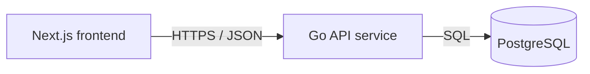

# Service & Interface Design — Let's build a website

Last updated: 2026-05-27
Source: `docs/content/SRS.md`, `docs/architecture/erd.md`

## 1. Service map



| Service | Responsibility | Owns (tables) | Depends on | Deploy unit |
|---|---|---|---|---|
| `web` | Render the single content screen; owns no data | — | `api` | container `code/frontend` |
| `api` | Read and serve the content value over HTTP; owns the schema | `contents` | PostgreSQL | container `code/backend` |

**Why these boundaries** — the frontend/backend split is justified by deploy
cadence and runtime (a browser bundle vs a long-running server). There is a
single backend service: no further boundary is justified by ownership, scaling,
or deploy cadence, so none is drawn.

## 2. Cross-cutting contract

### 2.1 Base

- Base URL: `{scheme}://{host}/api/v1`
- Content type: `application/json; charset=utf-8`
- Versioning: URL path major version (`/v1`). A new major version only for
  breaking changes.
- Trace header: `X-Request-Id` accepted from the caller, generated if absent,
  echoed on every response and present in every log line.

### 2.2 Authentication and authorization

| Aspect | Decision |
|---|---|
| Mechanism | None — the only actor is a Guest |
| Token lifetime | n/a |
| Refresh | n/a |
| Transport | n/a |
| Roles | None |
| Enforcement point | n/a — every endpoint is public read |

No auth of any kind. The content is public and there is no write action, so
there is no credential to issue, verify, or rotate.

### 2.3 Error contract

Every non-2xx response, from every endpoint, has this shape:

```json
{
  "error": {
    "code": "NOT_FOUND",
    "message": "Human-readable summary, safe to show a user.",
    "details": [],
    "request_id": "01HX…"
  }
}
```

Consumers branch on `code`. `message` is display text and may be reworded at
any time without notice — it is not part of the contract.

**Error catalog** — the full closed set for this project.

| Code | HTTP | Meaning | Retryable |
|---|---|---|---|
| `NOT_FOUND` | 404 | The content row does not exist | yes |
| `INTERNAL` | 500 | Unexpected failure; details are logged, not returned | yes |
| `UNAVAILABLE` | 503 | Database unreachable, query timed out, or service shutting down | yes |

No other code may be returned. `VALIDATION_FAILED`, `UNAUTHENTICATED`,
`PERMISSION_DENIED`, `CONFLICT`, and `RATE_LIMITED` are omitted deliberately:
this project has no request body to validate, no auth, no writes, and no rate
limit. They may only be added when a feature that needs them is introduced.

### 2.4 Pagination

One scheme for the whole project, reserved for future list endpoints:

```
GET /api/v1/items?limit=50&cursor=eyJpZCI6…
```

```json
{ "data": [ … ], "next_cursor": "eyJpZCI6…", "has_more": true }
```

| Aspect | Decision |
|---|---|
| Style | cursor (stable under concurrent writes) |
| Default limit | 50 |
| Max limit | 100 |
| Default sort | `created_at DESC`, `id ASC` as tiebreaker |

**Not applied yet**: the single product endpoint returns one resource (the
singleton `contents` row), so it has no `limit`, `cursor`, or `data` wrapper.
The scheme above is the contract future list endpoints must follow.

### 2.5 Validation boundary

The boundary is the Go HTTP handler layer in `cmd/api`. Every field arriving
from outside — currently none, since the only endpoint has no request body and
no query parameters — is validated there, before any handler logic. Downstream
of that layer, code may trust its inputs and must not re-validate defensively.

On the read path the database enforces the data-correctness invariants
(`NOT NULL`, `ck_contents_value_not_blank`, `uq_contents_singleton`). The
decision to render an *empty or absent* value as the error state is the
frontend's responsibility (SRS §4, AC-7, AC-8), not the API's — see §3.1 notes.

### 2.6 Idempotency

No write endpoints exist, so no `Idempotency-Key` is accepted and none is
retained. If a write endpoint is ever added, it must accept an
`Idempotency-Key` header, retain keys for 24 hours, and return the original
response on a replay.

## 3. Endpoints

### 3.1 `GET /api/v1/content`

**Purpose** — return the single display string. **Traces to** — CONTENT-001,
CONTENT-002, CONTENT-003. **Auth** — none (public read).

**Path / query parameters**

None.

**Request body**

None. The request carries no body; any body sent is ignored.

**Success response** — `200 OK`

```json
{
  "value": "Hello Word"
}
```

| Field | Type | Nullable | Description |
|---|---|---|---|
| `value` | string | no | The stored display string, from `contents.value`. Exactly `Hello Word` under the seeded schema. |

The resource is a single object, returned directly (not wrapped in `data`) per
the API conventions: a single resource returns the object, not a wrapper.

**Errors** — every code this endpoint can return. No others.

| Code | HTTP | Trigger |
|---|---|---|
| `NOT_FOUND` | 404 | `contents` has no row (the seed is absent or the table is empty) |
| `UNAVAILABLE` | 503 | Database unreachable, or the query times out |
| `INTERNAL` | 500 | Any other unexpected failure (e.g. scan error) |

**Notes**

- **Empty value is not a distinct API state.** The schema's
  `ck_contents_value_not_blank` rejects an empty string on write, so a stored
  empty value can only arise out-of-band (manual DB change). The API returns
  the value as-is; if it is empty, the *frontend* renders the error state per
  AC-8. The API does not synthesize a 4xx for it, because the API contract
  concerns "row present vs absent", not display correctness.
- **Read-only:** the endpoint performs no writes, no cache eviction, no
  side effects.
- **Consistency:** the handler runs `SELECT value FROM contents LIMIT 1`; the
  singleton unique index guarantees at most one row, so `LIMIT 1` is a
  defensive cap, not a semantic choice.
- **Caching:** no `Cache-Control` directive is mandated; the frontend fetches
  fresh on every load and on retry (CONTENT-002, CONTENT-003). A caching layer
  is out of scope until the value becomes mutable.

### 3.2 `GET /healthz`

**Purpose** — liveness and readiness probe; reports healthy only after
migrations succeeded and the DB answers `SELECT 1`. **Traces to** — none
(operational, not a product requirement). **Auth** — none.

**Path / query parameters**

None.

**Request body**

None.

**Success response** — `200 OK`

```json
{ "status": "ok" }
```

| Field | Type | Nullable | Description |
|---|---|---|---|
| `status` | string | no | Always `"ok"` on success |

**Errors**

| Code | HTTP | Trigger |
|---|---|---|
| `UNAVAILABLE` | 503 | Migrations failed, or `SELECT 1` failed |

**Notes** — this is the container healthcheck target (architecture overview
§3.2). It does not read `contents`; a missing content row does not make the
service unhealthy, because that failure is surfaced by `GET /api/v1/content`
as `NOT_FOUND`, not by the probe.

## 4. Asynchronous work

None. No jobs, queues, schedules, or events exist in this product; the only
flow is a synchronous read on page load.

## 5. External integrations

None. The only dependency is the project's own PostgreSQL, which is a storage
dependency, not a third-party integration, and is covered by the
`UNAVAILABLE` error path in §2.3. No external API, payment gateway, email, or
SMS is called.

## 6. Non-functional targets

| Aspect | Target |
|---|---|
| p95 latency (read) | 100 ms (single-row read, local DB) |
| p95 latency (write) | n/a — no write path |
| Availability | Single instance; degraded (error state) rather than wrong when DB is down |
| Rate limit | None — public read, one row |
| Payload cap | 4 KiB request; response is a single short string |
| Timeout (inbound) | 5 s on `GET /api/v1/content`; frontend treats a timeout as a failed fetch → error state (AC-5) |

## 7. Observability

- Log fields present on every request line: `request_id`, `method`, `path`,
  `status`, `duration_ms`.
- Metrics per endpoint: rate, error count, and duration.
- What is never logged: the content value is public and may be logged, but no
  passwords, tokens, or personal data exist; if a request body is ever added,
  full bodies must never be logged.

## 8. Contract evolution

| Change | Additive or breaking | Migration path |
|---|---|---|
| Add a write endpoint (e.g. edit the text) | Additive (new endpoint) | Ship alongside `Idempotency-Key` support per §2.6; existing read path unchanged |
| Add a list endpoint | Additive (new endpoint) | Follow the §2.4 pagination scheme |
| Wrap the single resource in `{"data": …}` | Breaking | Do not; single resources return the object directly per conventions |
| Rename `value` or change its type | Breaking | Needs a new major version or a parallel field + deprecation window |
| Make the value mutable and cache it | Additive | Introduce caching behind a new `Cache-Control` directive; the current no-cache fetch keeps working |
| Add auth to this endpoint | Breaking | Rejects the Guest actor the SRS requires; would need its own story and a migration off public read |

## 9. Open questions

| Question | Owner | Blocking |
|---|---|---|
| — none — | — | — |

## 10. Requirement traceability

| Requirement | Endpoint |
|---|---|
| CONTENT-001 — render the database value | `GET /api/v1/content` |
| CONTENT-002 — loading state | `GET /api/v1/content` (frontend shows loading until the response arrives) |
| CONTENT-003 — error state and retry | `GET /api/v1/content` (frontend renders error on any non-2xx / timeout, retry re-issues the same GET) |

| Endpoint | Requirement |
|---|---|
| `GET /api/v1/content` | CONTENT-001, CONTENT-002, CONTENT-003 |
| `GET /healthz` | — operational, not a product requirement |
